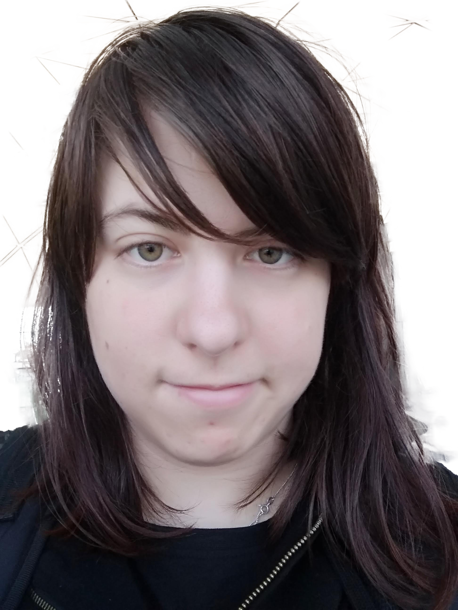

  

  # Brigitta van Besouw
  ### Fine Art · Illustration · Graphic Design · UI/UX
  *Making things feel seen, understood, and properly shaped.*

  [Instagram](https://www.instagram.com/gitas.art) &nbsp;|&nbsp;
  [LinkedIn](https://www.linkedin.com/in/brigittavbesouw/) &nbsp;|&nbsp;
  [YouTube](https://www.youtube.com/@gitasart) &nbsp;|&nbsp;
  [Ko-fi](https://ko-fi.com/gitasart) &nbsp;|&nbsp;
  [Linktree](https://linktr.ee/GitasArt)

---

## About

I create fine art, illustration, graphic design, and UI/UX for people who want their ideas properly shaped. Not just decorated. Made clear.

Some projects need emotion. Some need structure. The best ones need both.

---

## Skills

**Traditional**
`Oils` `Watercolour` `Acrylic` `Gouache` `Ink & Graphite` `Paper Collage` `Mixed Media`

**Digital**
`Digital Illustration` `UI Art & Visual Design` `Graphic Design` `Product Design & UI/UX` `Vibe Coding`

**Tools**
`Figma` `Figma Make` `Framer` `Procreate` `Cursor` `Lovable` `Adobe Suite`

---

## Interests

Japan &nbsp;|&nbsp; Travelling &nbsp;|&nbsp; Food &nbsp;|&nbsp; Anime &nbsp;|&nbsp; Miniature Painting &nbsp;|&nbsp; Tech &nbsp;|&nbsp; [Guinea Pigs 🐹](https://www.instagram.com/4piggiewiggles)

---

## Contact

| | |
|---|---|
| 🌐 Website | [brigittavanbesouwfineart](https://sites.google.com/view/brigittavanbesouwfineart/home) |
| 📁 Portfolio | [View PDF](https://drive.google.com/file/d/1PfhLj-078bdeIJsbX2qX-ZiEVEMvqL1R/view?usp=drive_link) |
| 📧 Email | [hello.gitasart@gmail.com](mailto:hello.gitasart@gmail.com) |
| 🔗 Links | [Linktree](https://linktr.ee/GitasArt) |

---

  Got an idea that needs form? Tell me what you're making.

